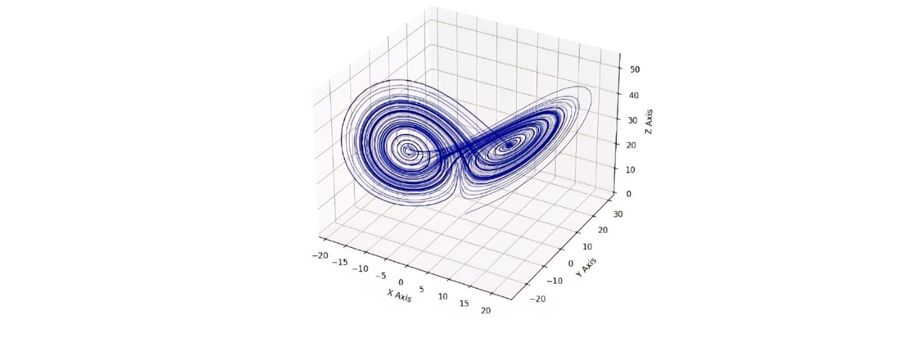

The following python code produces the ***Lorenz Attractor***, which is a classic example of the _butterfly effect_. The governing set of differential equations are given by
$$
\frac{dx}{dt} = \sigma(y-x)
$$
$$
\frac{dy}{dt} = x(\rho - z) - y
$$
$$
\frac{dz}{dt} = xy - \beta z
$$
The code and the outcome obtained is given below

```python
import numpy as np
import matplotlib.pyplot as plit
from mpl_toolkits.mplot3d import Axes3D
sigma=10.0
rho=28.0
beta=8.0/3.0
dt=0.01
steps=10000
xs=np.empty(steps+1)
ys=np.empty(steps+1)
zs=np.empty(steps+1)
xs[0], ys[0], xs[0] = (0.0,1.0,1.05)
for i in range(steps):
    x=xs[i]
    y=ys[i]
    z=zs[i]
    xs[i+1]=x+sigma*(y-x)*dt
    ys[i+1]=y+(x*(rho-z)-y)*dt
    zs[i+1]=z+(x*y-beta*z)*dt
fig=plit.figure(figsize=(10,7))
ax=fig.add_subplot(111,projection='3d')
ax.plot(xs,ys,zs,lw=0.5,color="darkblue")
ax.set_title("Lorenz Attractor (Butterfly Effect)",fontsize=14)
ax.set_xlabel("X Axis")
ax.set_ylabel("Y Axis")
ax.set_zlabel("Z Axis")
plit.show()
```

